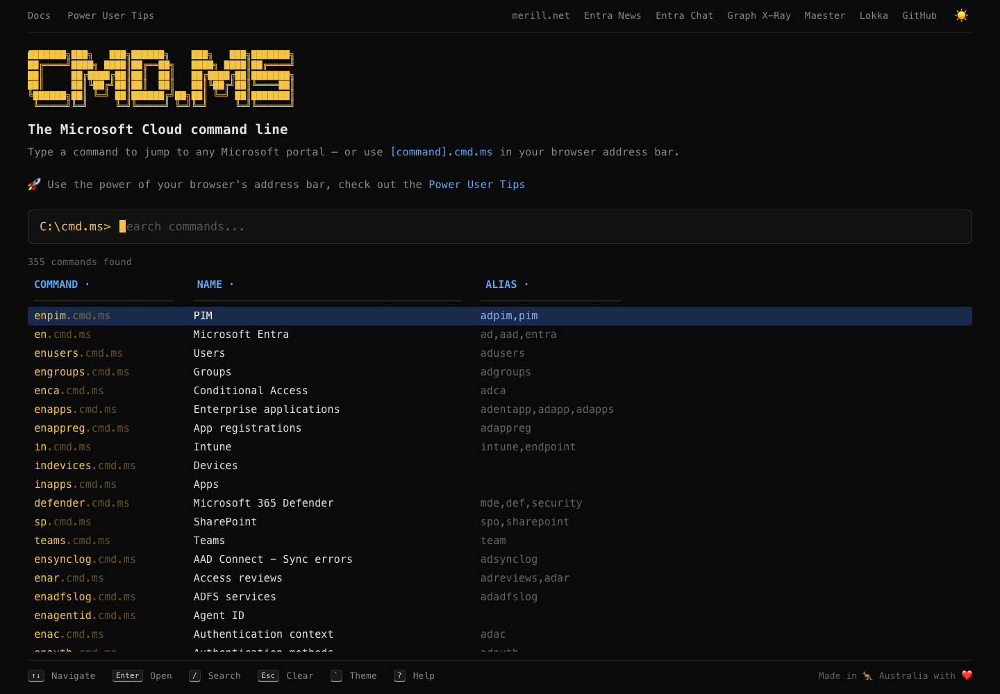

# [cmd.ms]

[cmd.ms] the Microsoft Cloud command line!

Please visit [cmd.ms](https://cmd.ms) to learn how it works.

If you would like to create a PR to add a command, please read the [Contributing](https://cmd.ms/docs/contributing) page for guidance on naming conventions.

## Sponsors

cmd.ms is free and ad-free, with no investors behind it. If it saves you time, please consider [sponsoring me on GitHub](https://github.com/sponsors/merill). 💙

